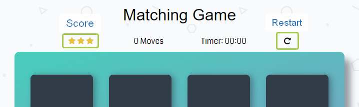

# Memory Game Project

## Table of Contents

* [Instructions](#instructions)
* [Contributing](#contributing)

## Instructions

To play the game, just begin from openning any card and __"Let the game begin!"__

Your score depends on count of your moves.

All game information, such as:
* Score
* Moves
* Elapsed time

shows on the top of the gameboard.

Also if you whant to start the game from the beginning, you can click restart button in the top-right corner.

## Contributing

This repository is the starter code for _all_ Udacity students. Therefore, we most likely will not accept pull requests.

For details, check out [CONTRIBUTING.md](CONTRIBUTING.md).

## Gratitude

___Thanks for awesome alert window [SweetAlert.js](https://sweetalert.js.org/) team!___